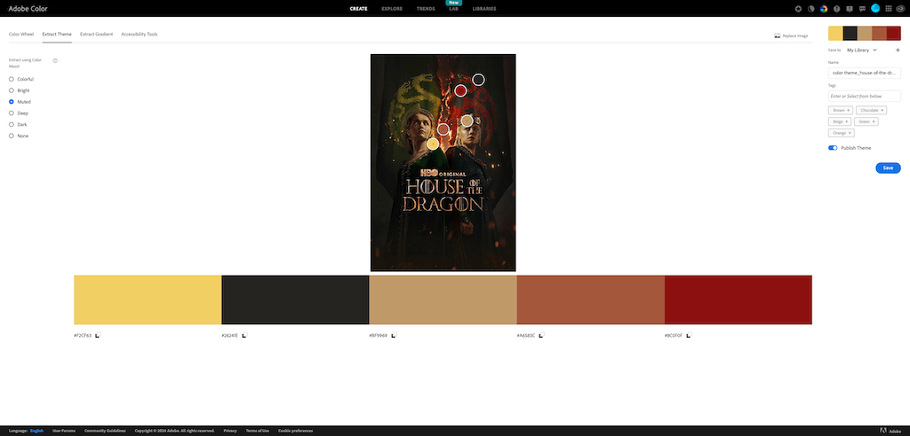
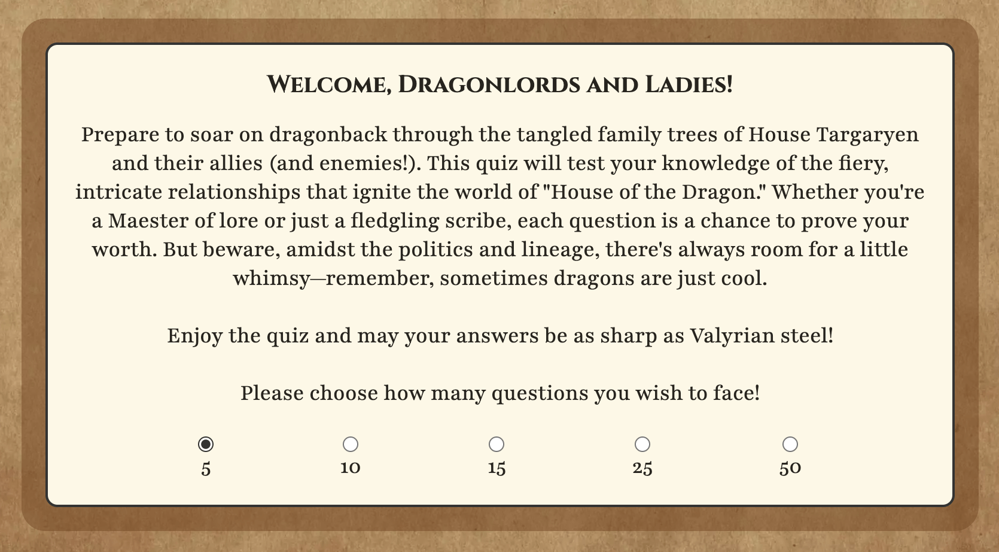
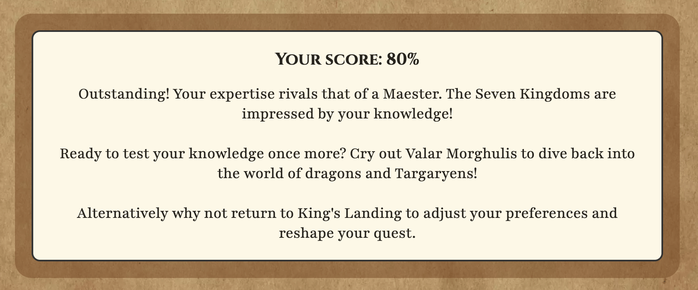
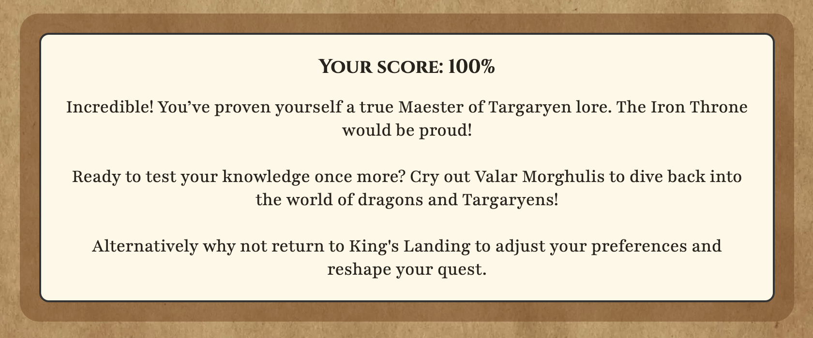

# Dragons are Cool

Dragons are Cool is a web based quiz that challenges the user to answer questions based on the intricate and often confusing family relationships in the tv show 'House of the Dragon'. Players can choose how many questions will be in the quiz ranging from 5 to 50 and the questions for every quiz are randomly generated from a pool of 50 questions. There is also an easter egg within the game that appears if you answer all questions with the "Dragons are cool" option.

source: [Techsini Multi Device Website Mockup Generator](http://techsini.com/multi-mockup/?url=https://apeskinian.github.io/p2_dac/)

## UX

The strategy was to create a web based quiz based on a whimsical Instagram post that was shared to me. The idea that as confusing as it can be to follow who is who in the tv show, they have dragons, and dragons are cool.

Inspiration: [Instagram post](https://www.instagram.com/reel/C84vGgdu4kZ/?igsh=NGF3bGh2cTNyeThn)

The scope of features I wanted to include were:
- A broad pool of questions that I can draw from so as not to make the quiz repetitive.
- A way to incorporate an option of answering "Dragons are cool" for each question that leads to an easter egg if you always choose that.
- A progress bar to show the user how far along in the quiz they are.
- An option to choose how many questions you want in the quiz.
- A feedback system that gives you different messages based on your end score.
- A visual indication on how you did on each question as you progress through the quiz.
- A help menu on every page should the user need guidance.

The structure of the site would be linear so as to easily guide the user through the quiz:
1. Introduction page explaining the quiz and also where the user chooses the length.
2. Game page: this is where the quiz will run and most of the users time will be spent here.
3. Results pages. Depending on what their answers were there will be two options:
   - Standard results page where their score is calculated as a percentage and a relevant message given.
   - Easter egg page if they answered "Dragons are cool" for every answer.

In the wireframing process I decided to keep the "action" buttons always in a similar place and have them the same colour. This should allow the user to quickly get used to how to navigate easily. The help menu would be placed at the bottom.

I then used some images from the show to generate my colour scheme for the site so that everything looked nice.

### Colour Scheme

| Colour Ref | Elements |
| --- | --- |
| `#26241E` | Dark text |
| `#F5F5F5` | Light text |
| `#333` | Dark borders & Quiz length option accent |
| `#590202` | Main buttons |
| `rgba(89, 2, 2, 0.5)` | Main logo background |
| `rgba(115, 72, 34, 0.5)` | Shaded background boxes |
| `FDF8E7` | Text and Answer option backgrounds |
| `F9E9B8` | No selection message, Question, Progress bar and Help menu backgrounds |
| `rgba(89, 2, 2, 0.7)` | Progress bar |
| `93C47D` | Correct answer highlight |
| `A65638` | Incorrect answer highlight |
| `#F2CF63` | Selected answer highlight |

I used [Adobe](https://color.adobe.com/create/image) to generate my colour scheme from the sample images.
I also used [Color Shades Generator](https://mdigi.tools/color-shades/#f2cf63) to help get some different shades from the palette.

| Adobe Palette 1 | Adobe Palette 2 | Color Shades Generator |
| --- | --- | --- |
|  |  |  |

### Typography

- [Cinzel](https://fonts.google.com/specimen/Cinzel) was used for the primary headers and titles.

- [Playfair](https://fonts.google.com/specimen/Playfair) was used for all other secondary text.

- [Font Awesome](https://fontawesome.com) icons were used throughout the site, such as the help menu logo and links within the help menus.

## User Stories

### New Site Users

- As a new site user, I would like to play a quiz, so that I can have a bit of fun!
- As a new site user, I would like to know if I get a question correct, so that I can feel good about it!
- As a new site user, I would like to know if I get a question wrong and also see the correct answer, so that I can learn from it.
- As a new site user, I would like to know my final score, so that I can try and beat it next time.
- As a new site user, I would like to control how long the quiz will be, so that I can do more or less depending on how long I want to play.
- As a new site user, I may not fully understand the function of the main buttons as they have themed quotes.

### Returning Site Users

- As a returning site user, I would like to control how long the quiz will be, so that I can do more or less depending on how long I want to play.
- As a returning site user, I would like to see if I can figure out why there is always a "Dragons are cool option", so that I can see what happens if maybe I choose that every time...
- As a returning site user, I would like to have different questions, so that it does not feel repetitive.
- As a returning site user, I would like to have different feedback on questions, so that it does not feel repetitive.

## Wireframes

### Mobile Wireframes

| Home | Answer selected | Correct answer | Incorrect answer | Help | Results | Results - Dragons are cool |
| :---: | :---: | :---: | :---: | :---: | :---: | :---: |
|  |  |  |  |  |  |  |

### Tablet Wireframes

| Home | Answer selected | Correct answer | Incorrect answer | Help | Results | Results - Dragons are cool |
| :---: | :---: | :---: | :---: | :---: | :---: | :---: |
|  |  |  |  |  |  |  |

### Desktop Wireframes

| Home | Answer selected | Correct answer | Incorrect answer | Help | Results | Results - Dragons are cool |
| :---: | :---: | :---: | :---: | :---: | :---: | :---: |
|  |  |  |  |  |  |  |

## Features
- ### Title and Logo
  The title and logo remain in the same place throughout the site. A silhouette of a dragon looping around back to itself with quiz title place over it. The looping of the dragon signifies the ability to keep playing the quiz as many times as you like. As screen size increases, the title and logo adjust responsively.
  
  

- ### Introduction and quiz length selector
  This is the introduction area which describes the quiz to the user and offers them the ability to choose the desired number of questions they will answer. It defaults to 5 but they can choose 10, 15, 25 or 50. Every time the quiz is run the questions are randomly pulled from the pool of 50 questions.

  

- ### Distinctive main action buttons
  The main buttons to navigate through the quiz are all styled the same so that the user will become familiar with this and instinctively use them as such.

  | Button | Action | Pages found on |
  | --- | --- | --- |
  |  | Starts a new quiz | Homepage and both results page types |
  |  | Submits the answer | Main quiz page |
  |  | Moves to next question | Main quiz page |
  |  | Takes the user back to the home screen | Both results page types and 404 Page |
  |  | Dismisses the no selection warning | Main quiz page |

- ### Help Menu
  This menu can be found on every page and when expanded will give you some assistance on what you can do depending on what page you're currently on.

  

  | Help Content | Page found on |
  | --- | --- |
  |  | Homepage |
  |  | Main quiz page |
  |  | Results pages |
  |  | 404 Page |

- ### Tooltips
  The main game buttons feature tooltips as they use themed words that users may not be familiar with to begin with.

  |  |  |  |
  | --- | --- | --- |
  |  |  |  |
  |  |  |  |

- ### Interactive Quiz

 - #### Overview
   - The main page of this site is where you undertake the challenge to answer the questions!
   - Each question is loaded in one at a time from the previously randomly selected set. The questions will be displayed above five selectable answers. One answer must be selected to continue, if the user tries to continue without selecting an answer, a notice will pop up informing them they need to make a selection.
   - Each question is a multiple choice with five options. There is one correct answer and four incorrect answers of which one will always be "Dragons are cool".
   - Every time a question is loaded, the answers are randomly placed in the options. This means that if you were to get two questions the same in consecutive quizzes, the answers will not be in the same order.
   - Each quiz does not have duplicate questions.
   - There is a progress bar at the top of the area to inform the user how far along in the quiz they are.

   | Quiz Area | Progress Bar | Selection Error |
   | :---: | :---: | :---: |
   |  |  |  |

 - #### Answering Questions
   When the user has selected an answer it will be highlighted, then when the submit button is clicked the answer will be checked to see if they got it right. If it is correct they will see their choice turn green and get a success message in the question box. However if they have guessed incorrectly their choice will be highlighted in red while the correct answer is highlighted green. They will get an incorrect message in the question box. Both correct and incorrect feedback messages are also randomly selected from a pool of twenty choices per set. This helps to keep the game from being repetitive.

   | Answer Selected | Correct Attempt | Incorrect Attempt |
   | :---: | :---: | :---: |
   |  |  |  |

- #### Results
  When the quiz has finished the results will be shown. The user is given a percentage score calculated from their correct answers. They will also get some feedback depending on how well they did. Options to play again or go back and change options are also given here.

  | User Score Window | Feedback Received |
  | :---: | :---: |
  | 0% |  |
  | 1-9% |  |
  | 10-19% |  |
  | 20-29% |  |
  | 30-39% |  |
  | 40-49% |  |
  | 50-59% |  |
  | 60-69% |  |
  | 70-79% |  |
  | 80-89% |  |
  | 90-99% |  |
  | 100% |  |

- #### Easter egg results
  If a user has entered the answer "Dragons are cool" for every question they faced they will encounter a different results screen!

  

- ### 404 Error page
  This page shows up when there has been a 404 error. It gives the user the option to navigate back to the homepage.

  

### Future Features
  - I would like to add the ability to save players scores to a scoreboard page that keeps the information so that players can see how they perform against other people.
  - Adding more quizzes with different topics and themes. The quiz function would remain the same and the homepage can give you the option for what theme of quiz to choose too. The homepage would have its own styling but each quiz would have specific style relevant to the theme.

## Tools & Technologies Used

-  used to generate README and TESTING templates.
-  used for version control. (`git add`, `git commit`, `git push`)
-  used for secure online code storage.
-  used as a cloud-based IDE for development.
-  used for the main site content.
-  used for the main site design and layout.
-  used for user interaction on the site.
-  used for hosting the deployed front-end site.
-  used for creating wireframes.
-  used for the icons.
-  used to create the questions and themed text content for the quiz.
-  Used to track scores and question count across multiple pages.

## Testing

> [!NOTE]  
> For all testing, please refer to the [TESTING.md](TESTING.md) file.

## Deployment

The site was deployed to GitHub Pages. The steps to deploy are as follows:

- In the [GitHub repository](https://github.com/apeskinian/p2_dac), navigate to the Settings tab 
- From the source section drop-down menu, select the **Main** Branch, then click "Save".
- The page will be automatically refreshed with a detailed ribbon display to indicate the successful deployment.

The live link can be found [here](https://apeskinian.github.io/p2_dac)

### Local Deployment

This project can be cloned or forked in order to make a local copy on your own system.

#### Cloning

You can clone the repository by following these steps:

1. Go to the [GitHub repository](https://github.com/apeskinian/p2_dac) 
2. Locate the Code button above the list of files and click it 
3. Select if you prefer to clone using HTTPS, SSH, or GitHub CLI and click the copy button to copy the URL to your clipboard
4. Open Git Bash or Terminal
5. Change the current working directory to the one where you want the cloned directory
6. In your IDE Terminal, type the following command to clone my repository:
	- `git clone https://github.com/apeskinian/p2_dac.git`
7. Press Enter to create your local clone.

Alternatively, if using Gitpod, you can click below to create your own workspace using this repository.

Please note that in order to directly open the project in Gitpod, you need to have the browser extension installed.
A tutorial on how to do that can be found [here](https://www.gitpod.io/docs/configure/user-settings/browser-extension).

#### Forking

By forking the GitHub Repository, we make a copy of the original repository on our GitHub account to view and/or make changes without affecting the original owner's repository.
You can fork this repository by using the following steps:

1. Log in to GitHub and locate the [GitHub Repository](https://github.com/apeskinian/p2_dac)
2. At the top of the Repository (not top of page) just above the "Settings" Button on the menu, locate the "Fork" Button.
3. Once clicked, you should now have a copy of the original repository in your own GitHub account!

### Local VS Deployment

There are no differences between the local and deployed version of the site.

## Credits

### Content

| Source | Location | Notes |
| --- | --- | --- |
| [Markdown Builder](https://tim.2bn.dev/markdown-builder) | README and TESTING | tool to help generate the Markdown files |
| [A Complete Guide to Flexbox](https://css-tricks.com/snippets/css/a-guide-to-flexbox/) | Entire Site | Using flexbox |
| [Stack Overflow](https://stackoverflow.com/questions/12605908/change-background-image-opacity) | dac.html | Change background image opacity |
| [Stack Overflow](https://stackoverflow.com/questions/21054126/how-to-detect-if-a-device-has-mouse-support) | Entire Site | Media query to check for mouse |
| [W3Schools](https://www.w3schools.com/css/css_tooltip.asp) | Entire Site | Tooltips |
| [Javascript.info](https://javascript.info/task/shuffle) | Quiz Page | Fisher-Yates/Knuth shuffle in JS |
| [YouTube](https://www.youtube.com/watch?v=YL1F4dCUlLc) | Entire site | using `localStorage()` in JS for accessing data across pages |
| [YouTube](https://www.youtube.com/watch?v=Xy9ZXRRgpLk&t=982s) | Entire Site | using dynamic viewport heights and widths |
| [ChatGPT](https://openai.com/) | Entire Site | Themed text content |
| [YouTube](https://www.youtube.com/watch?v=riDzcEQbX6k) | See note below | Quiz tutorial |

> [!NOTE]  
> I didn't use a tutorial online to build this project, but for the sake of providing a link/credit in case assessors think I've followed a tutorial, I've referenced one that my mentor recommended to add to the README credits. Unless specified all code is my own, as I've got previous developer experience prior to this course.

### Media

| Source | Location | Type | Notes |
| --- | --- | --- | --- |
| [favicon.io](https://favicon.io/favicon-converter/) | Entire site | Image | Favicon on all pages |
| [Pexels](https://www.pexels.com/photo/empty-brown-canvas-235985/) | Entire site | Image | Background on all pages |
| [Freepik](https://www.freepik.com/free-vector/dragon-silhouettes_786264.htm#fromView=search&page=1&position=18&uuid=9d840b63-71b8-449b-b294-184d7890c2b3) | Entire Site | Image | Main logo and favicon |
| [Freepik](https://www.freepik.com/free-vector/silhouette-castle-flying-dragon_2331206.htm#fromView=search&page=1&position=37&uuid=360afcf8-70fc-445a-b1cb-0f42d628202d) | Entire Site | Image | Progress bar image |
| [Freepik](https://www.freepik.com/free-vector/silhouette-castle-flying-dragon_2331211.htm#fromView=search&page=1&position=5&uuid=5ba8b20b-fe48-4556-8e48-db18ecf6b0c1) | Results easter egg | Image | Easter egg image |
| [Font Awesome](https://fontawesome.com/icons/circle-question?f=classic&s=regular) | Entire Site | Image | Help menu icon |
| [Font Awesome](https://fontawesome.com/icons/fort-awesome?f=brands&s=solid) | Game Page | Image | Home link icon |
| [Font Awesome](https://fontawesome.com/icons/rotate-right?f=classic&s=solid) | Game Page | Image | Reload page icon |
| [TinyPNG](https://tinypng.com) | Entire Site | Image | Tool for image compression |
| [Adobe Express](https://www.adobe.com/express/feature/video/convert/mov-to-gif) | TESTING | Image | Tool for mov to gif conversion |

### Acknowledgements

- I would like to thank my Code Institute mentor, [Tim Nelson](https://github.com/TravelTimN) for his support throughout the development of this project.
- I would like to thank the [Code Institute](https://codeinstitute.net) tutor team for their assistance with troubleshooting and debugging some project issues.
- I would like to thank the [Code Institute Slack community](https://code-institute-room.slack.com) for the moral support; it kept me going during periods of self doubt and imposter syndrome.
- I would like to thank my daughter Niamh, my sister Natalie and my whole family for believing in me, and supporting me while making this transition into software development.
