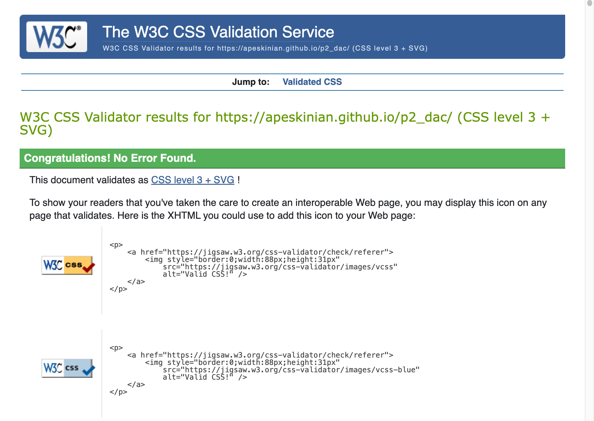
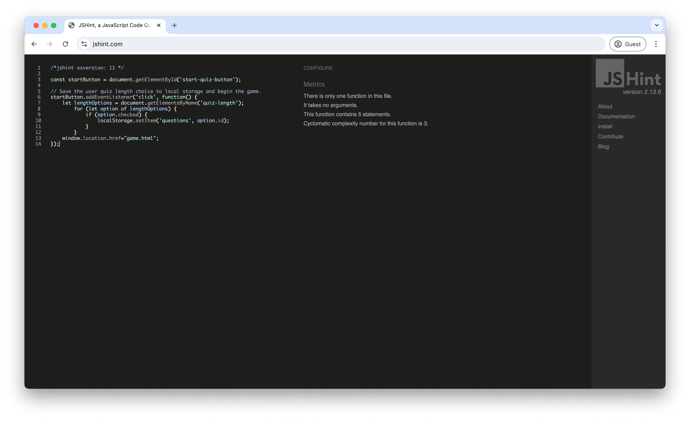
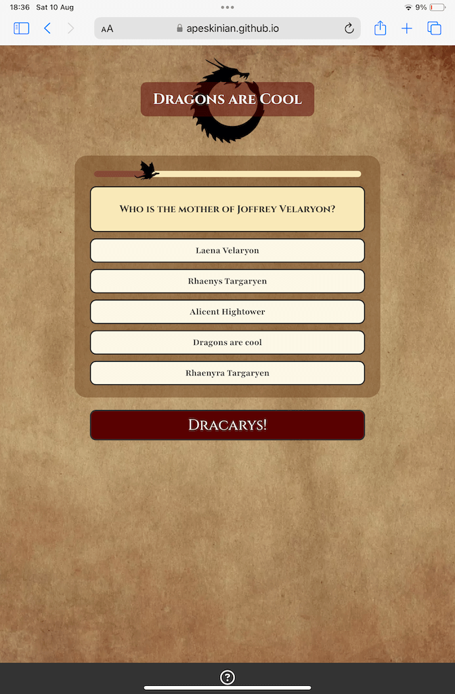
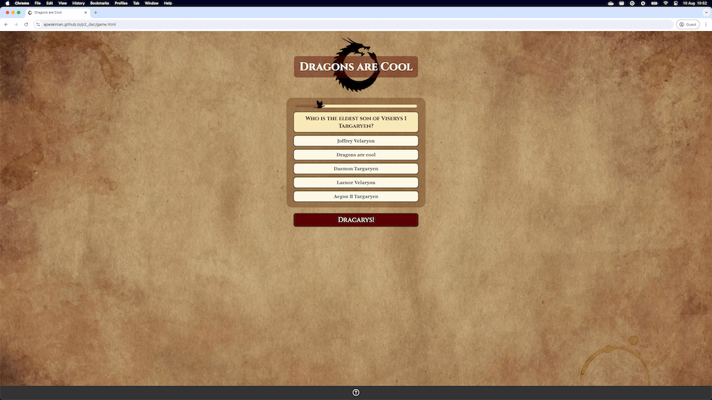
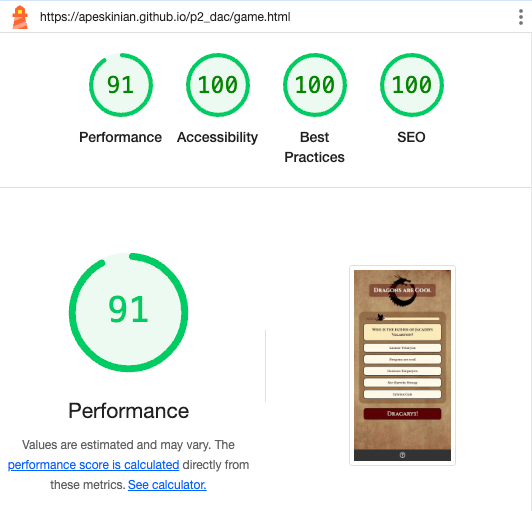
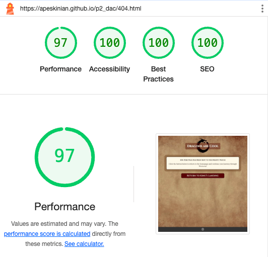

# Testing

> [!NOTE]  
> Return back to the [README.md](README.md) file.

## Code Validation

### HTML

I have used the recommended [HTML W3C Validator](https://validator.w3.org) to validate all of my HTML files.

| Directory | File | Link | Screenshot |
| --- | --- | --- | --- |
|  | index.html | [Validate index.html](https://validator.w3.org/nu/?doc=https://apeskinian.github.io/p2_dac/index.html) |  |
|  | game.html | [Validate game.html](https://validator.w3.org/nu/?doc=https://apeskinian.github.io/p2_dac/game.html) |  |
|  | results.html | [Validate results.html](https://validator.w3.org/nu/?doc=https://apeskinian.github.io/p2_dac/results.html) |  |
|  | dac.html | [Validate dac.html](https://validator.w3.org/nu/?doc=https://apeskinian.github.io/p2_dac/dac.html) |  |
|  | 404.html | [Validate 404.html](https://validator.w3.org/nu/?doc=https://apeskinian.github.io/p2_dac/404.html) |  |

### CSS

I have used the recommended [CSS Jigsaw Validator](https://jigsaw.w3.org/css-validator) to validate all of my CSS files.

| Directory | File | Link | Screenshot |
| --- | --- | --- | --- |
| assets/css | style.css | [Validate style.css](http://jigsaw.w3.org/css-validator/validator?lang=en&profile=css3svg&uri=https%3A%2F%2Fapeskinian.github.io%2Fp2_dac%2F&usermedium=all&vextwarning=&warning=1) |  |

### JavaScript

I have used the recommended [JShint Validator](https://jshint.com) to validate all of my JS files.

| Directory | File | Screenshot | Notes |
| --- | --- | --- | --- |
| assets/js | quiz-length.js |  | Unused variable is called from index.html |
| assets/js | game-data.js |  | Unused variables are used in game-script.js |
| assets/js | game-script.js |  | Undefined variables are defined in game-data.js and the unused variables are called from game.html |
| assets/js | results.js |  |  |

## Browser Compatibility

I've tested my deployed project on multiple browsers to check for compatibility issues.

| Browser | Home | Game | Results | Dac | 404 | Notes |
| --- | --- | --- | --- | --- | --- | --- |
| Chrome |  |  |  |  |  | Works as expected |
| Firefox |  |  |  |  |  | Works as expected |
| Edge |  |  |  |  |  | Works as expected |
| Safari |  |  |  |  |  | Works as expected |

## Responsiveness

I've tested my deployed project on multiple devices to check for responsiveness issues.

| Device | Home | Game | Results | Results DAC | 404 | Notes |
| --- | --- | --- | --- | --- | --- | --- |
| Mobile (DevTools) |  |  |  |  |  | Works as expected |
| Tablet (DevTools) |  |  |  |  |  | Works as expected |
| 4k Monitor (DevTools) |  |  |  |  |  | Scaling issues beginning |
| iPhone 15 Pro |  |  |  |  |  | Works as expected |
| iPad Mini |  |  |  |  |  | Works as expected |
| MacBook Air M3 |  |  |  |  |  | Works as expected |
| 2K Desktop Monitor |  |  |  |  |  | Works as expected |

## Lighthouse Audit

I've tested my deployed project using the Lighthouse Audit tool to check for any major issues.

| Page | Mobile | Desktop | Notes |
| --- | --- | --- | --- |
| index.html |  |  |  |
| game.html |  |  |  |
| results.html |  |  |  |
| dac.html |  |  |  |
| 404.html |  |  |  |

## Defensive Programming

Defensive programming was manually tested with the below user acceptance testing:

| Page | Expectation | Test | Result | Fix | Screenshot |
| --- | --- | --- | --- | --- | --- |
| Home | | | | | |
| | The help menu should show and hide with the ? button. Quiz length selectors should be highlighted when clicked and when the main action button is clicked the quiz should start. | Tested the feature by clicking the ? and then again to close, clicking on the different quiz length options and then clicking on Valar Morghulis! | The feature behaved as expected, the help menu was shown and hidden. The quiz length selectors were highlighted and the main action button started the quiz. | Test concluded and passed |  |
| Game | | | | | |
| | Feature is expected to do X when the user does Y | Tested the feature by doing Y | The feature behaved as expected, and it did Y | Test concluded and passed |  |
| Results | | | | | |
| | Feature is expected to do X when the user does Y | Tested the feature by doing Y | The feature behaved as expected, and it did Y | Test concluded and passed |  |
| Results DAC | | | | | |
| | Feature is expected to do X when the user does Y | Tested the feature by doing Y | The feature behaved as expected, and it did Y | Test concluded and passed |  |
| 404 | | | | | |
| | The help menu should show and hide with the ? button and the Return to King's Landing button should take you back to the home screen | Tested the feature by clicking the ? and then again to close, then clicking on the Return to King's landing button | The feature behaved as expected, the help menu was shown and the page navigated home on clicking of the Return to King's Landing button | Test concluded and passed |  |

## User Story Testing

| User Story | Screenshot |
| --- | --- |
| As a new site user, I would like to play a quiz, so that I can have a bit of fun! |  |
| As a new site user, I would like to know if I get a question correct, so that I can feel good about it! |  |
| As a new site user, I would like to know if I get a question wrong and also see the correct answer, so that I can learn from it. |  |
| As a new site user, I would like to know my final score, so that I can try and beat it next time. |  |
| As a new site user, I would like to control how long the quiz will be, so that I can do more or less depending on how long I want to play. |  |
| As a returning site user, I would like to control how long the quiz will be, so that I can do more or less depending on how long I want to play. |  |
| As a returning site user, I would like to see if I can figure out why there is always a "Dragons are cool option", so that I can see what happens if maybe I choose that everytime... |  |
| As a returning site user, I would like to have different questions, so that it does not feel repetitive. |  |
| As a returning site user, I would like to have different feedback on questions, so that it does not feel repetitive. |  |

## Bugs

| Bug | Fix |
| :---: | :---: |
| I was made aware that you could still progress through the quiz when the non selection message was on screen. The screenshot shows an incorrect answer feedback when there should not have been any progress. | To fix this, I wrapped the check for valid selections and the check answer code after that into an if statement. This prevented the game from progressing if there was nothing selected. I also added code to disable answer inputs while the message was on screen. |
|  |  |
| When playing on mobile devices if you start to tap faster through the game sometimes it activates the double tap to zoom function. I found this hindered the free flow of playing | By adding a class of no-double-tap-zoom to all buttons and then using the CSS "touch-action: manipulation;" this disabled double tapping to zoom while still keeping other gestures useable. |
|  |  |

## Unfixed Bugs

> [!NOTE]  
> There are no remaining bugs that I am aware of.
