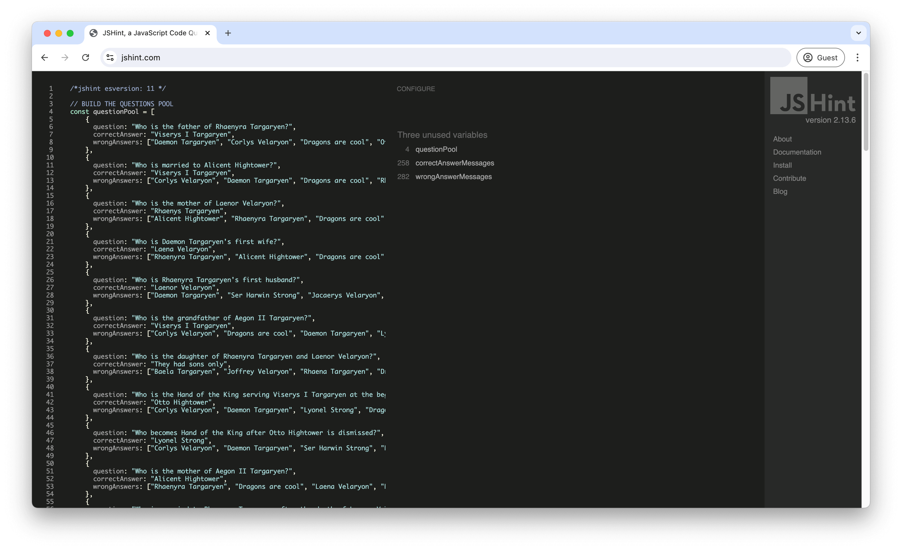
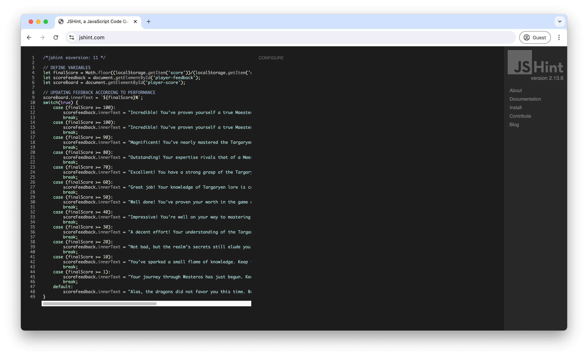
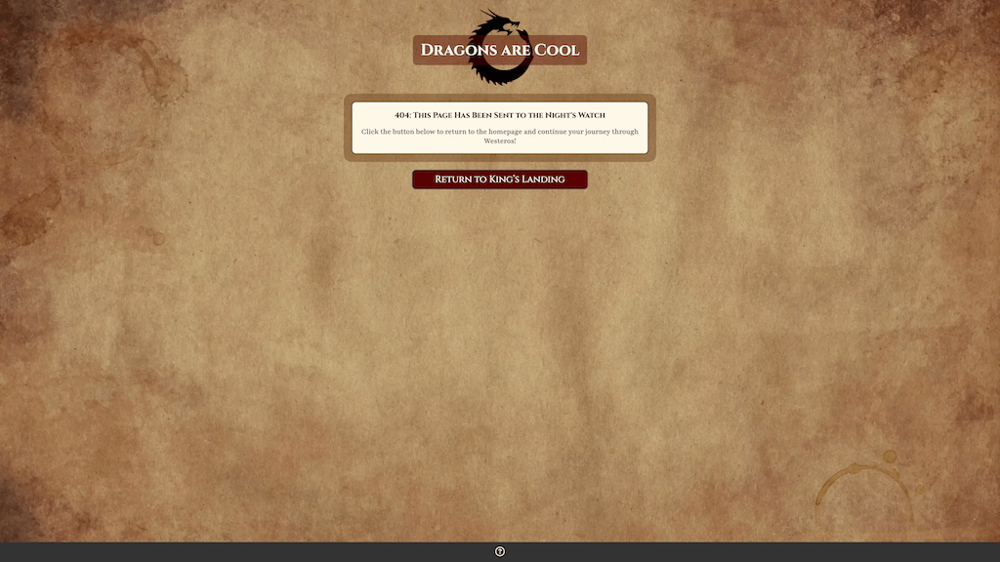
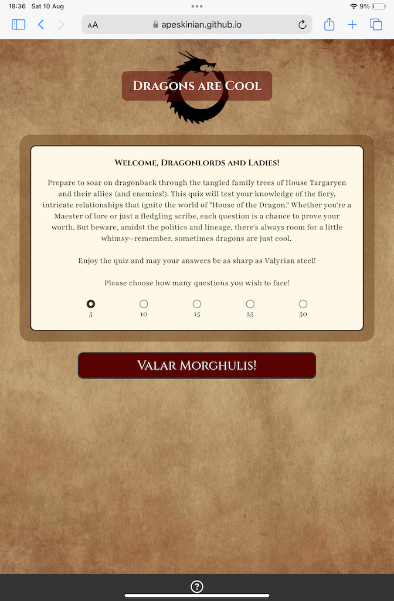
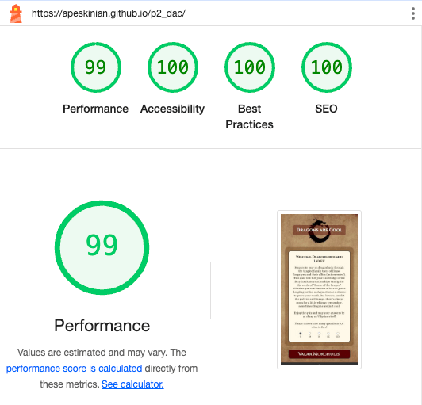
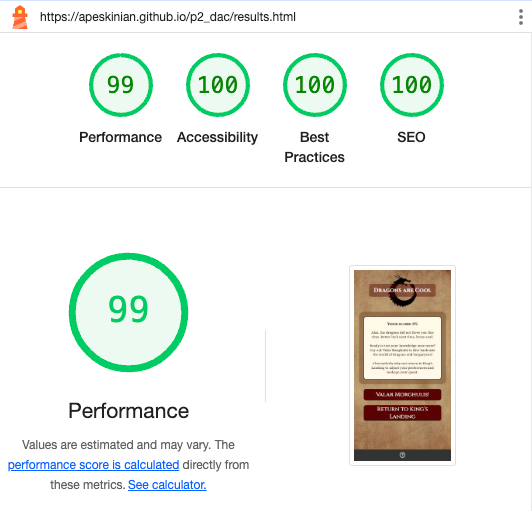
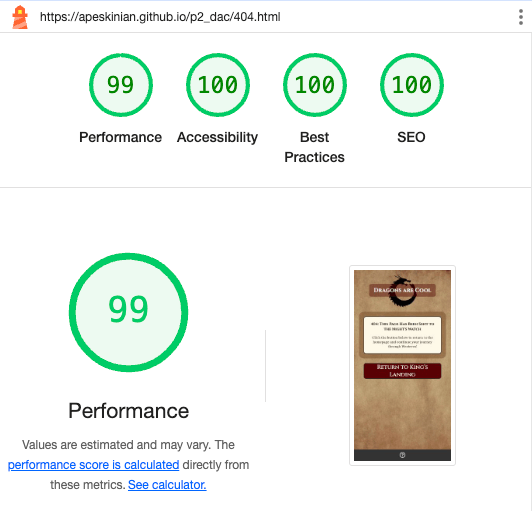

# Testing

> [!NOTE]  
> Return back to the [README.md](README.md) file.

## Code Validation

### HTML

I have used the recommended [HTML W3C Validator](https://validator.w3.org) to validate all of my HTML files.

| Directory | File | Link | Screenshot |
| --- | --- | --- | --- |
|  | index.html | [Validate index.html](https://validator.w3.org/nu/?doc=https://apeskinian.github.io/p2_dac/index.html) |  |
|  | game.html | [Validate game.html](https://validator.w3.org/nu/?doc=https://apeskinian.github.io/p2_dac/game.html) |  |
|  | results.html | [Validate results.html](https://validator.w3.org/nu/?doc=https://apeskinian.github.io/p2_dac/results.html) |  |
|  | dac.html | [Validate dac.html](https://validator.w3.org/nu/?doc=https://apeskinian.github.io/p2_dac/dac.html) |  |
|  | 404.html | [Validate 404.html](https://validator.w3.org/nu/?doc=https://apeskinian.github.io/p2_dac/404.html) |  |

### CSS

I have used the recommended [CSS Jigsaw Validator](https://jigsaw.w3.org/css-validator) to validate all of my CSS files.

| Directory | File | Link | Screenshot |
| --- | --- | --- | --- |
| assets/css | style.css | [Validate style.css](http://jigsaw.w3.org/css-validator/validator?lang=en&profile=css3svg&uri=https%3A%2F%2Fapeskinian.github.io%2Fp2_dac%2F&usermedium=all&vextwarning=&warning=1) |  |

### JavaScript

I have used the recommended [JShint Validator](https://jshint.com) to validate all of my JS files.

| Directory | File | Screenshot | Notes |
| --- | --- | --- | --- |
| assets/js | quiz-length.js |  | Unused variable is called from index.html |
| assets/js | game-data.js |  | Unused variables are used in game-script.js |
| assets/js | game-script.js |  | Undefined variables are defined in game-data.js and the unused variables are called from game.html |
| assets/js | results.js |  |  |

## Browser Compatibility

I've tested my deployed project on multiple browsers to check for compatibility issues.

| Browser | Home | Game | Results | Dac | 404 | Notes |
| --- | --- | --- | --- | --- | --- | --- |
| Chrome |  |  |  |  |  | Works as expected |
| Firefox |  |  |  |  |  | Works as expected |
| Edge |  |  |  |  |  | Works as expected |
| Safari |  |  |  |  |  | Works as expected |

## Responsiveness

I've tested my deployed project on multiple devices to check for responsiveness issues.

| Device | Home | Game | Results | Results DAC | 404 | Notes |
| --- | --- | --- | --- | --- | --- | --- |
| Mobile (DevTools) |  |  |  |  |  | Works as expected |
| Tablet (DevTools) |  |  |  |  |  | Works as expected |
| 4k Monitor (DevTools) |  |  |  |  |  | Scaling issues beginning |
| iPhone 15 Pro |  |  |  |  |  | Works as expected |
| iPad Mini |  |  |  |  |  | Works as expected |
| MacBook Air M3 |  |  |  |  |  | Works as expected |
| 2K Desktop Monitor |  |  |  |  |  | Works as expected |

## Lighthouse Audit

I've tested my deployed project using the Lighthouse Audit tool to check for any major issues.

| Page | Mobile | Desktop | Notes |
| --- | --- | --- | --- |
| index.html |  |  |  |
| game.html |  |  |  |
| results.html |  |  |  |
| dac.html |  |  |  |
| 404.html |  |  |  |

## Defensive Programming

🛑🛑🛑🛑🛑🛑🛑🛑🛑🛑-START OF NOTES (to be deleted)

Defensive programming (defensive design) is extremely important!

When building projects that accept user inputs or forms, you should always test the level of security for each.
Examples of this could include (not limited to):

Forms:
- Users cannot submit an empty form
- Users must enter valid email addresses

PP3 (Python-only):
- Users must enter a valid letter/word/string when prompted
- Users must choose from a specific list only

MS3 (Flask) | MS4/PP4/PP5 (Django):
- Users cannot brute-force a URL to navigate to a restricted page
- Users cannot perform CRUD functionality while logged-out
- User-A should not be able to manipulate data belonging to User-B, or vice versa
- Non-Authenticated users should not be able to access pages that require authentication
- Standard users should not be able to access pages intended for superusers

You'll want to test all functionality on your application, whether it's a standard form,
or uses CRUD functionality for data manipulation on a database.
Make sure to include the `required` attribute on any form-fields that should be mandatory.
Try to access various pages on your site as different user types (User-A, User-B, guest user, admin, superuser).

You should include any manual tests performed, and the expected results/outcome.

Testing should be replicable.
Ideally, tests cases should focus on each individual section of every page on the website.
Each test case should be specific, objective, and step-wise replicable.

Instead of adding a general overview saying that everything works fine,
consider documenting tests on each element of the page
(ie. button clicks, input box validation, navigation links, etc.) by testing them in their happy flow,
and also the bad/exception flow, mentioning the expected and observed results,
and drawing a parallel between them where applicable.

Consider using the following format for manual test cases:

Expected Outcome / Test Performed / Result Received / Fixes Implemented

- **Expected**: "Feature is expected to do X when the user does Y."
- **Testing**: "Tested the feature by doing Y."
- (either) **Result**: "The feature behaved as expected, and it did Y."
- (or) **Result**: "The feature did not respond to A, B, or C."
- **Fix**: "I did Z to the code because something was missing."

Use the table below as a basic start, and expand on it using the logic above.

🛑🛑🛑🛑🛑🛑🛑🛑🛑🛑-END OF NOTES (to be deleted)

Defensive programming was manually tested with the below user acceptance testing:

| Page | Expectation | Test | Result | Fix | Screenshot |
| --- | --- | --- | --- | --- | --- |
| Home | | | | | |
| | Feature is expected to do X when the user does Y | Tested the feature by doing Y | The feature behaved as expected, and it did Y | Test concluded and passed |  |
| | Feature is expected to do X when the user does Y | Tested the feature by doing Y | The feature did not respond to A, B, or C. | I did Z to the code because something was missing |  |
| About | | | | | |
| | Feature is expected to do X when the user does Y | Tested the feature by doing Y | The feature behaved as expected, and it did Y | Test concluded and passed |  |
| | Feature is expected to do X when the user does Y | Tested the feature by doing Y | The feature did not respond to A, B, or C. | I did Z to the code because something was missing |  |
| Gallery | | | | | |
| | Feature is expected to do X when the user does Y | Tested the feature by doing Y | The feature behaved as expected, and it did Y | Test concluded and passed |  |
| | Feature is expected to do X when the user does Y | Tested the feature by doing Y | The feature did not respond to A, B, or C. | I did Z to the code because something was missing |  |
| Contact | | | | | |
| | Feature is expected to do X when the user does Y | Tested the feature by doing Y | The feature behaved as expected, and it did Y | Test concluded and passed |  |
| | Feature is expected to do X when the user does Y | Tested the feature by doing Y | The feature did not respond to A, B, or C. | I did Z to the code because something was missing |  |
| repeat for all remaining pages | x | x | x | x | x |

🛑🛑🛑🛑🛑🛑🛑🛑🛑🛑-START OF NOTES (to be deleted)

Another way of performing defensive testing is a simple Pass/Fail for each test.
The assessors prefer the above method, with the full test explained, but this is also acceptable in most cases.

When in doubt, use the above method instead, and delete the table below.

🛑🛑🛑🛑🛑🛑🛑🛑🛑🛑-END OF NOTES (to be deleted)

| Page | User Action | Expected Result | Pass/Fail | Comments |
| --- | --- | --- | --- | --- |
| Home | | | | |
| | Click on Logo | Redirection to Home page | Pass | |
| | Click on Home link in navbar | Redirection to Home page | Pass | |
| Gallery | | | | |
| | Click on Gallery link in navbar | Redirection to Gallery page | Pass | |
| | Load gallery images | All images load as expected | Pass | |
| Contact | | | | |
| | Click on Contact link in navbar | Redirection to Contact page | Pass | |
| | Enter first/last name | Field will accept freeform text | Pass | |
| | Enter valid email address | Field will only accept email address format | Pass | |
| | Enter message in textarea | Field will accept freeform text | Pass | |
| | Click the Submit button | Redirects user to form-dump | Pass | User must click 'Back' button to return |
| Sign Up | | | | |
| | Click on Sign Up button | Redirection to Sign Up page | Pass | |
| | Enter valid email address | Field will only accept email address format | Pass | |
| | Enter valid password (twice) | Field will only accept password format | Pass | |
| | Click on Sign Up button | Asks user to confirm email page | Pass | Email sent to user |
| | Confirm email | Redirects user to blank Sign In page | Pass | |
| Log In | | | | |
| | Click on the Login link | Redirection to Login page | Pass | |
| | Enter valid email address | Field will only accept email address format | Pass | |
| | Enter valid password | Field will only accept password format | Pass | |
| | Click Login button | Redirects user to home page | Pass | |
| Log Out | | | | |
| | Click Logout button | Redirects user to logout page | Pass | Confirms logout first |
| | Click Confirm Logout button | Redirects user to home page | Pass | |
| Profile | | | | |
| | Click on Profile button | User will be redirected to the Profile page | Pass | |
| | Click on the Edit button | User will be redirected to the edit profile page | Pass | |
| | Click on the My Orders link | User will be redirected to the My Orders page | Pass | |
| | Brute forcing the URL to get to another user's profile | User should be given an error | Pass | Redirects user back to own profile |
| repeat for all remaining pages | x | x | x | x |

🛑🛑🛑🛑🛑🛑🛑🛑🛑🛑-START OF NOTES (to be deleted)

Repeat for all other tests, as applicable to your own site.
The aforementioned tests are just an example of a few different project scenarios.

🛑🛑🛑🛑🛑🛑🛑🛑🛑🛑-END OF NOTES (to be deleted)

## User Story Testing

🛑🛑🛑🛑🛑🛑🛑🛑🛑🛑-START OF NOTES (to be deleted)

Testing user stories is actually quite simple, once you've already got the stories defined on your README.

Most of your project's **features** should already align with the **user stories**,
so this should as simple as creating a table with the user story, matching with the re-used screenshot
from the respective feature.

🛑🛑🛑🛑🛑🛑🛑🛑🛑🛑-END OF NOTES (to be deleted)

| User Story | Screenshot |
| --- | --- |
| As a new site user, I would like to play a quiz, so that I can have a bit of fun! |  |
| As a new site user, I would like to know if I get a question correct, so that I can feel good about it! |  |
| As a new site user, I would like to know if I get a question wrong and also see the correct answer, so that I can learn from it. |  |
| As a new site user, I would like to know my final score, so that I can try and beat it next time. |  |
| As a new site user, I would like to control how long the quiz will be, so that I can do more or less depending on how long I want to play. |  |
| As a returning site user, I would like to control how long the quiz will be, so that I can do more or less depending on how long I want to play. |  |
| As a returning site user, I would like to see if I can figure out why there is always a "Dragons are cool option", so that I can see what happens if maybe I choose that everytime... |  |
| As a returning site user, I would like to have different questions, so that it does not feel repetitive. |  |
| As a returning site user, I would like to have different feedback on questions, so that it does not feel repetitive. |  |

## Bugs

| Bug | Fix |
| :---: | :---: |
| I was made aware that you could still progress through the quiz when the non selection message was on screen. The screenshot shows an incorrect answer feedback when there should not have been any progress. | To fix this, I wrapped the check for valid selections and the check answer code after that into an if statement. This prevented the game from progressing if there was nothing selected. I also added code to disable answer inputs while the message was on screen. |
|  |  |

## Unfixed Bugs

> [!NOTE]  
> There are no remaining bugs that I am aware of.
