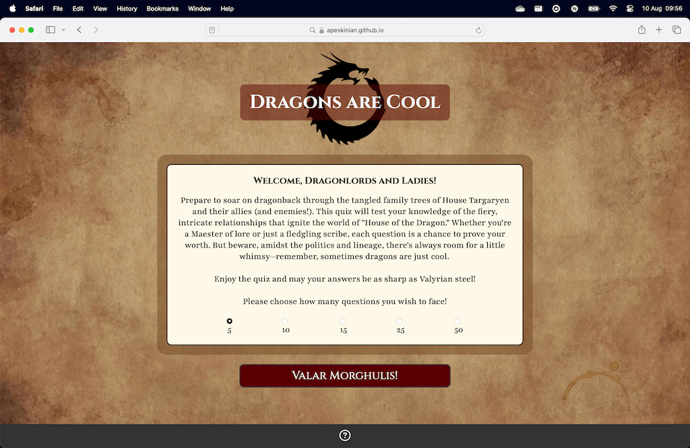
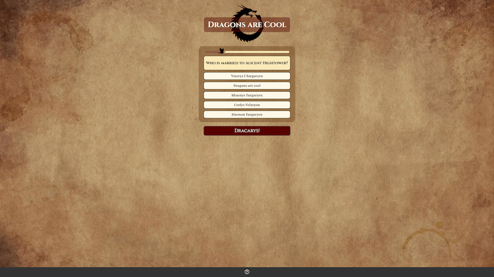
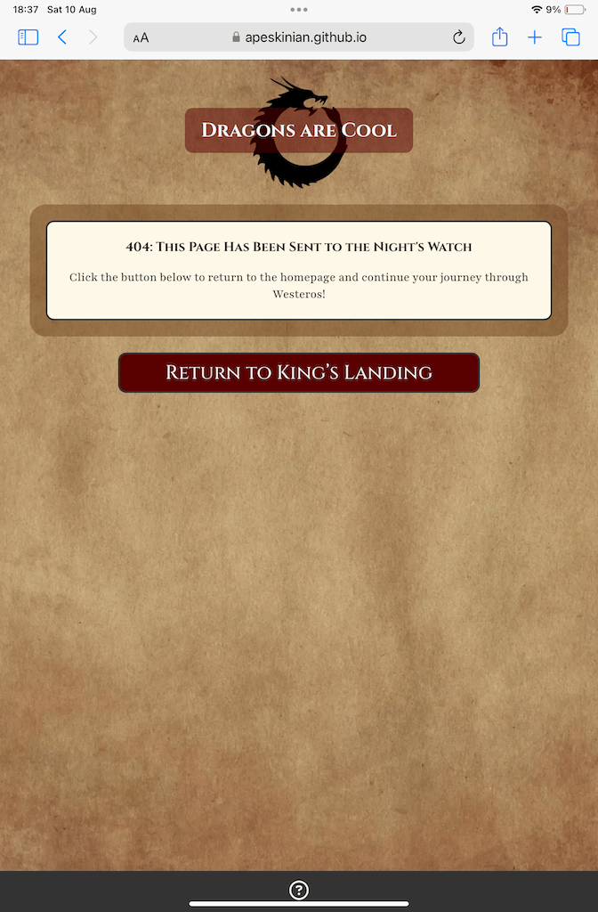
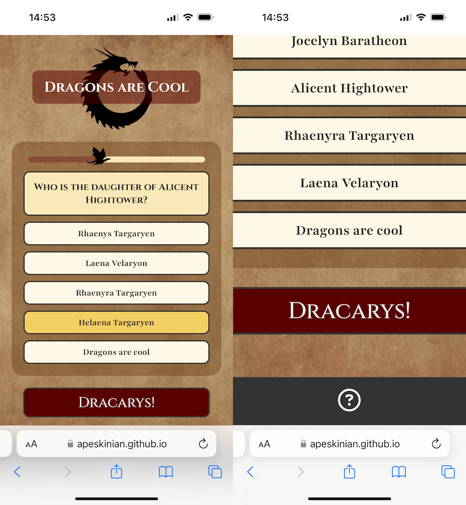

# Testing

> [!NOTE]  
> Return back to the [README.md](README.md) file.

## Code Validation

### HTML

I have used the recommended [HTML W3C Validator](https://validator.w3.org) to validate all of my HTML files.

| Directory | File | Link | Screenshot |
| --- | --- | --- | --- |
|  | index.html | [Validate index.html](https://validator.w3.org/nu/?doc=https://apeskinian.github.io/p2_dac/index.html) |  |
|  | game.html | [Validate game.html](https://validator.w3.org/nu/?doc=https://apeskinian.github.io/p2_dac/game.html) |  |
|  | results.html | [Validate results.html](https://validator.w3.org/nu/?doc=https://apeskinian.github.io/p2_dac/results.html) |  |
|  | dac.html | [Validate dac.html](https://validator.w3.org/nu/?doc=https://apeskinian.github.io/p2_dac/dac.html) |  |
|  | 404.html | [Validate 404.html](https://validator.w3.org/nu/?doc=https://apeskinian.github.io/p2_dac/404.html) |  |

### CSS

I have used the recommended [CSS Jigsaw Validator](https://jigsaw.w3.org/css-validator) to validate all of my CSS files.

| Directory | File | Link | Screenshot |
| --- | --- | --- | --- |
| assets/css | style.css | [Validate style.css](http://jigsaw.w3.org/css-validator/validator?lang=en&profile=css3svg&uri=https%3A%2F%2Fapeskinian.github.io%2Fp2_dac%2F&usermedium=all&vextwarning=&warning=1) |  |

### JavaScript

I have used the recommended [JShint Validator](https://jshint.com) to validate all of my JS files.

| Directory | File | Screenshot | Notes |
| --- | --- | --- | --- |
| assets/js | quiz-length.js |  |  |
| assets/js | game-data.js |  | Unused variables are used in game-script.js |
| assets/js | game-script.js |  | Undefined variables are defined in game-data.js |
| assets/js | results.js |  |  |

## Browser Compatibility

I've tested my deployed project on multiple browsers to check for compatibility issues.

| Browser | Home | Game | Results | Dac | 404 | Notes |
| --- | --- | --- | --- | --- | --- | --- |
| Chrome |  |  |  |  |  | Works as expected |
| Firefox |  |  |  |  |  | Works as expected |
| Edge |  |  |  |  |  | Works as expected |
| Safari |  |  |  |  |  | Works as expected |

## Responsiveness

I've tested my deployed project on multiple devices to check for responsiveness issues.

| Device | Home | Game | Results | Results DAC | 404 | Notes |
| --- | --- | --- | --- | --- | --- | --- |
| Mobile (DevTools) |  |  |  |  |  | Tooltips are disabled for mobile devices. |
| Tablet (DevTools) |  |  |  |  |  | Tooltips are disabled for mobile devices. |
| 4k Monitor (DevTools) |  |  |  |  |  | Scaling issues beginning |
| iPhone 15 Pro |  |  |  |  |  | Tooltips are disabled for mobile devices. |
| iPad Mini |  |  |  |  |  | Tooltips are disabled for mobile devices. |
| MacBook Air M3 |  |  |  |  |  | Works as expected |
| 2K Desktop Monitor |  |  |  |  |  | Works as expected |

## Lighthouse Audit

I've tested my deployed project using the Lighthouse Audit tool to check for any major issues.

| Page | Mobile | Desktop | Notes |
| --- | --- | --- | --- |
| index.html |  |  |  |
| game.html |  |  |  |
| results.html |  |  |  |
| dac.html |  |  |  |
| 404.html |  |  |  |

## Defensive Programming

Defensive programming was manually tested with the below user acceptance testing:

| Page | Expectation | Test | Result | Fix | Evidence |
| --- | --- | --- | --- | --- | --- |
| Home | | | | | |
| | The help menu should show and hide with the ? button. Quiz length selectors should be highlighted when clicked and when the main action button is clicked the quiz should start. | Tested the feature by clicking the ? and then again to close, clicking on the different quiz length options and then clicking on Valar Morghulis! | The feature behaved as expected, the help menu was shown and hidden. The quiz length selectors were highlighted and the main action button started the quiz. | Test concluded and passed |  |
| | By selecting different quiz lengths the quiz that is started should have the number of questions that was selected. | Tested the feature by selecting each option and starting the quiz. Looking at the progress bar will indicate the length. | The feature behaved as expected, each quiz started with the correct amount of questions, this was confirmed by the progress bar. | Test concluded and passed |  |
| Game | | | | | |
| | The help menu should show and hide on clicking. The reload button should load a fresh quiz of the same length. The home button should navigate back to the home page. | Tested the feature by clicking the ? button to show and then hide the menu. Then clicking it to open again. Clicking the reload button and then clicking the home button. | The feature behaved as expected, the help menu was shown and hidden. The reload button loaded a new quiz of the same length. The home button navigated home. | Test concluded and passed |  |
| | Trying to submit before selecting an answer should alert the user that they need to select an answer. No other answer buttons should be clickable while this message is on screen. | Tested by clicking the Dracarys! submit button before selecting an answer and then trying to click other buttons. | The feature behaved as expected, the error message appeared all other answer buttons were disabled until it was dismissed. | Test concluded and passed |  |
| | The help menu should still be fully active and working when the non selection message is visible. | Tested by activating the message and then trying the buttons in the help menu. | The feature behaved as expected, the quiz was reloaded and message dismissed with the reload button. The home button navigated back to the home scree. | Test concluded and passed |  |
| | The answer the user selects should be highlighted when clicked, this should change should they choose a different answer. | Tested by clicking on various answers for a question. | The feature behaved as expected, every time a new answer was selected it was highlighted and the previous one returned to normal. | Test concluded and passed |  |
| | When a chosen answer is correct it should be highlighted green and one of the success messages should appear in the question box. The main action button text should now read "Swear Your Oath!" | Tested by submitting a correct answer. | The feature behaved as expected, the chosen answer was highlighted green and a success message appeared in the question box. The action button text changed correctly. | Test concluded and passed |  |
| | When a chosen answer is incorrect it should be highlighted red and one of the unsuccessful messages should appear in the question box. The correct answer should be highlighted green. The main action button text should now read "Swear Your oath!" | Tested by submitting an incorrect answer. | The feature behaved as expected, the chosen answer was highlighted red and an unsuccessful message appeared in the question box. The correct answer was highlighted green. The action button text changed correctly. | Test concluded and passed |  |
| | When the last question is answered and submitted the user should be taken to the results screen where they can see their score as a percentage with a relevant message according to the score. | Tested by finishing a quiz and seeing what happened when "Swear Your Oath!" was clicked. | The feature behaved as expected, the results page was displayed with the calculated score as percentage and a relevant feedback message to the score. | Test concluded and passed |  |
| | If every answer submitted is "Dragons are cool" the user should be taken to a different results screen. | Tested by answering all questions in a 5 question quiz with "Dragons are cool" | The feature behaved as expected, at the end of the quiz the special results page was shown instead of the normal one. | Test concluded and passed |  |
| | If every answer submitted is "Dragons are cool" the user should be taken to a different results screen. | Tested by answering all questions in a 10 question quiz with "Dragons are cool" | The feature behaved as expected, at the end of the quiz the special results page was shown instead of the normal one. | Test concluded and passed |  |
| | If every answer submitted is "Dragons are cool" the user should be taken to a different results screen. | Tested by answering all questions in a 15 question quiz with "Dragons are cool" | The feature behaved as expected, at the end of the quiz the special results page was shown instead of the normal one. | Test concluded and passed |  |
| | If every answer submitted is "Dragons are cool" the user should be taken to a different results screen. | Tested by answering all questions in a 25 question quiz with "Dragons are cool" | The feature behaved as expected, at the end of the quiz the special results page was shown instead of the normal one. | Test concluded and passed |  |
| | If every answer submitted is "Dragons are cool" the user should be taken to a different results screen. | Tested by answering all questions in a 50 question quiz with "Dragons are cool" | The feature behaved as expected, at the end of the quiz the special results page was shown instead of the normal one. | Test concluded and passed |  |
| Results | | | | | |
| | The help menu should show and hide with the ? button. The Return to King's Landing button should take you back to the home screen. The Valar Morghulis! button should start another quiz. | Tested the feature by clicking on the ? button to show and again to hide. Clicking on the Return to King's Landing button, navigating back in the browser and then clicking on Valar Morghulis! button. | The feature behaved as expected, the help menu was shown and then hidden. Both buttons navigated to where they should. | Test concluded and passed |  |
| Results DAC | | | | | |
| | The help menu should show and hide with the ? button. The Return to King's Landing button should take you back to the home screen. The Valar Morghulis! button should start another quiz. | Tested the feature by clicking on the ? button to show and again to hide. Clicking on the Return to King's Landing button, navigating back in the browser and then clicking on Valar Morghulis! button. | The feature behaved as expected, the help menu was shown and then hidden. Both buttons navigated to where they should. | Test concluded and passed |  |
| 404 | | | | | |
| | The help menu should show and hide with the ? button and the Return to King's Landing button should take you back to the home screen | Tested the feature by clicking the ? and then again to close, then clicking on the Return to King's landing button | The feature behaved as expected, the help menu was shown and the page navigated home on clicking of the Return to King's Landing button | Test concluded and passed |  |

## User Story Testing

| User Story | Screenshot |
| --- | --- |
| As a new site user, I would like to play a quiz, so that I can have a bit of fun! |  |
| As a new site user, I would like to know if I get a question correct, so that I can feel good about it! |  |
| As a new site user, I would like to know if I get a question wrong and also see the correct answer, so that I can learn from it. |  |
| As a new site user, I would like to know my final score, so that I can try and beat it next time. |  |
| As a new site user, I would like to control how long the quiz will be, so that I can do more or less depending on how long I want to play. |  |
| As a returning site user, I would like to control how long the quiz will be, so that I can do more or less depending on how long I want to play. |  |
| As a returning site user, I would like to see if I can figure out why there is always a "Dragons are cool option", so that I can see what happens if maybe I choose that every time... |  |
| As a returning site user, I would like to have different questions, so that it does not feel repetitive. |  |
| As a returning site user, I would like to have different feedback on questions, so that it does not feel repetitive. |  |

## Bugs

| Bug | Fix |
| :---: | :---: |
| I was made aware that you could still progress through the quiz when the non selection message was on screen. The screenshot shows an incorrect answer feedback when there should not have been any progress. | To fix this, I wrapped the check for valid selections and the check answer code after that into an if statement. This prevented the game from progressing if there was nothing selected. I also added code to disable answer inputs while the message was on screen. |
|  |  |
| When playing on mobile devices if you start to tap faster through the game sometimes it activates the double tap to zoom function. I found this hindered the free flow of playing | By adding a class of no-double-tap-zoom to all buttons and then using the CSS "touch-action: manipulation;" this disabled double tapping to zoom while still keeping other gestures useable. |
|  |  |
| When viewing the site on iOS mobile devices and mobile Chrome the 100vh setting for the body would not work properly and the page would not fit on the screen as it does in the devtools | Using dynamic viewport height fixed this, the body min-height is set to 100dvh instead of 100vh |
|  |  |

## Unfixed Bugs
> [!NOTE]  
> There are no remaining bugs that I am aware of.

## Known Issues
> [!NOTE]
> The tooltips for the main buttons will only appear on devices with a mouse as the :hover pseudo class does not work on mobile devices.
